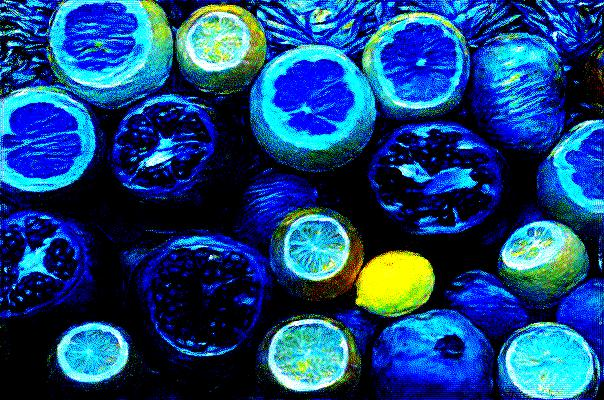

# Neural Style Transfer

This repository contains the code for my implementation of the Neural Style Transfer paper by Gatys et al.

The deep learning model is able to take a content image and render it in the form of a given style image.

### Sample

**Content Image**

**Style Image**

**Rendered Image from model**

### Setup and Training

See the `requirements.txt` for dependecies related to Python. After cloning the repository, you can install all these requirements using the `make` command. It is recommended to create a **virtual environment** for this purpose.
The Makefile will then run the **main.py** script to start training the model with sample images.
The model will run for 20000 iterations before saving the new image in the **data** folder. From my experiments, this should take around 14.5 minutes on a Tesla P100 GPU.
You can train using your own images by specifying the `--content` and/or `--style` argument when running the **main.py** script.

### References

- [A Neural Algorithm of Artistic Style](https://arxiv.org/abs/1508.06576)
